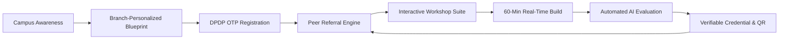
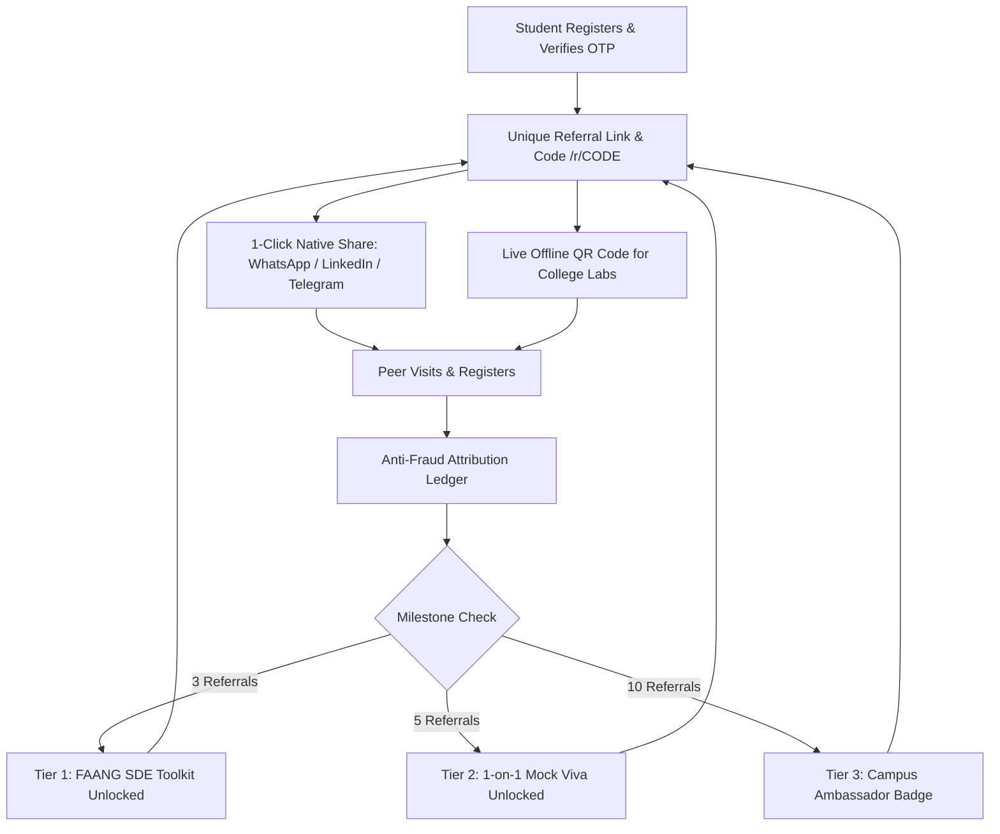
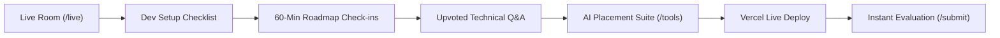
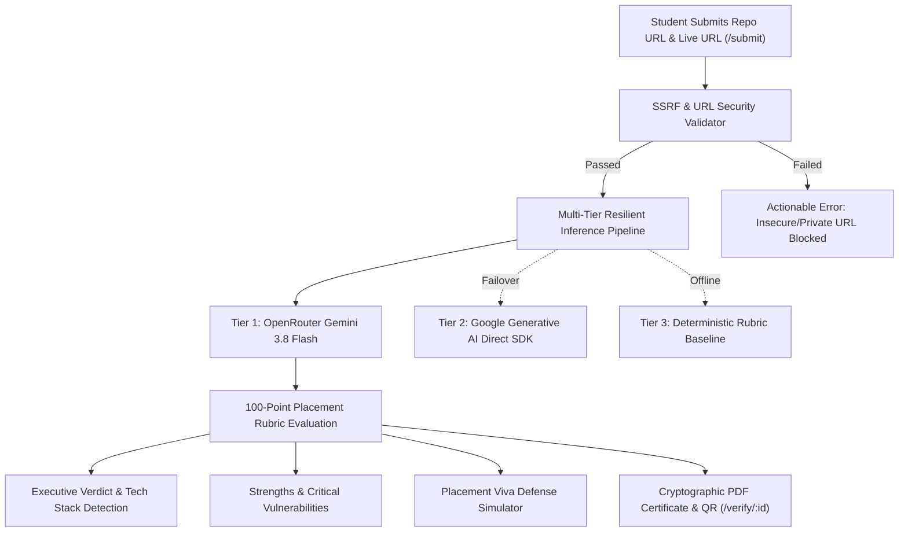
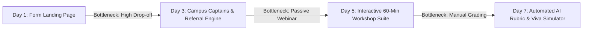

# NxtWave CCBP 4.0 Growth Case Study
## From a 60-Minute Workshop to a Sustainable Campus Growth Loop
**Campaign:** *"Build Your First AI Project in 60 Minutes"* &bull; **Target:** 500 Verified Final-Year Registrations &bull; **Budget:** ₹2,000 &bull; **Timeline:** 7 Days  
**Author:** Growth Intern Candidate &bull; **Engine:** FirstBuild Full-Stack Operating System (Next.js 16 &bull; Supabase &bull; OpenRouter Gemini 3.8 Flash)

---

# PAGE 1 — The Evolution & Growth Thesis

### The Initial Trap: Why Landing Pages Alone Fail
When I first approached NxtWave’s growth challenge, my initial instinct was identical to what 95% of candidates produce: design a high-converting landing page, embed a registration form, and broadcast the link across student WhatsApp groups. 

However, as I modeled the student lifecycle, I uncovered a fatal flaw in this conventional approach: **registration is only an acquisition event, not the growth engine itself.** In technical higher education, free webinars routinely suffer from catastrophic drop-offs:
* **The Ghost Lead Problem:** 60–70% of students who fill out a simple web form never show up on the workshop day.
* **The Passive Drop-off:** Of those who enter a standard Zoom/YouTube stream, over 80% minimize the tab within 15 minutes because passive listening creates zero behavioral commitment.
* **The Zero-Advocacy End:** When a webinar ends with theoretical slides, students close the window with nothing tangible to show their peers. The acquisition loop terminates permanently at the exit button.

If my campaign spent ₹2,000 on broad acquisition to drive students into a passive webinar, the growth loop would collapse before generating compounding returns.

### The Growth Thesis: Product Experience as Acquisition
I realized that to secure **500 verified registrations** and turn them into **200+ live builders**, the workshop could not be an isolated event. It had to be engineered as a **closed-loop growth system** where product value and viral distribution reinforce each other at every touchpoint:
1. **Pre-Registration Value (The Hook):** Instead of demanding an email upfront, the landing page allows students to select their engineering branch (CSE, ECE, EEE, MECH, CIVIL) and domain interest to immediately generate an AI-tailored project blueprint and placement readiness score.
2. **Immediate Peer Virality (The Multiplier):** The moment a student verifies their seat, their confirmation screen transforms into an active referral engine offering tangible academic unlocks (FAANG interview toolkits and 1-on-1 mock vivas).
3. **Active Technical Engagement (The Retention):** During the session, students build an actual application in 60 minutes guided by real-time dev checklists, milestone check-ins, and live technical Q&A feeds.
4. **Automated Verification & Social Proof (The Loop Closer):** Upon deployment, an automated AI evaluation engine audits their GitHub repository and live URL against an authoritative 100-point rubric, issuing a tamper-proof vector PDF certificate with a verifiable QR code ready for instant LinkedIn sharing.

### What Changed? The Strategic Shift

| Growth Dimension | Initial Thinking (Day 1) | Final Implemented Architecture (Day 7) |
| :--- | :--- | :--- |
| **System Scope** | Standalone registration landing page | Full-stack Growth Operating System (`/`, `/live`, `/tools`, `/submit`, `/referrals`) |
| **Acquisition Vector** | One-way broadcast across student groups | Decentralized Campus Captain Network (`/captain/[code]`) + Compounding Peer Referral Loop |
| **Value Proposition** | Generic webinar promise ("Learn AI") | Branch-personalized project blueprints before registration (`/api/blueprints`) |
| **Session Delivery** | Passive video stream with chat box | Interactive hands-on laboratory with real-time roadmap milestone check-ins (`/live`) |
| **Evaluation Model** | Manual code review (unscalable for 500) | Automated multi-tier AI evaluation pipeline using OpenRouter Gemini 3.8 Flash (`/submit`) |
| **Proof-of-Work** | Generic participation certificate | Tamper-proof vector PDF with SHA-256 credential ledger & QR verification (`/verify/[id]`) |

> **Growth Insight:** By transforming the workshop from a passive seminar into an interactive, credentialed software product, acquisition ceases to be an expensive top-of-funnel chore and becomes the natural byproduct of student project building.

# PAGE 2 — Acquisition, Target Audience & Referral Engine

### The Target Audience: Engineering Students Under Placement Pressure
My campaign targets **final-year (Class of 2026/2027) B.Tech/B.E. students** across Tier-2 and Tier-3 technical institutions across India (e.g., JNTU Hyderabad, Osmania, CBIT, VNR VJIET, GRIET, COEP Pune, BMS Bangalore, Anna University, SRM, VIT):
* **The Reality:** Mass campus recruitment by legacy IT service companies has contracted by 40–60%. Hiring panels now demand demonstrable, deployable full-stack and generative AI competency.
* **The Pain Point:** Final-year engineering students have intense placement anxiety. Their resumes are cluttered with generic academic clones (to-do lists, bookstore management systems) that get rejected by automated ATS screening software within seconds.
* **Why They Care:** *"Build Your First AI Project in 60 Minutes"* provides an antidote: a working deployed HTTPS application, a quantified Google XYZ resume bullet, and an audited proof-of-work asset to defend in campus placement vivas.

### Three Prioritized Grassroots Channels (Zero Ad Waste)
Rather than diluting effort across 20 speculative tactics, I concentrated 100% of execution into three high-leverage grassroots distribution channels:

| Acquisition Channel | Core Action | Strategic Rationale | Target Contribution |
| :--- | :--- | :--- | :--- |
| **1. Campus Captain Network** | Onboard 40 student leaders (CRs, club heads) via `/captain/[code]` | Student leaders possess established high-trust WhatsApp broadcasting networks across college sections. | **60% (~320 regs)** &bull; Avg 8.0 regs / captain |
| **2. Peer Referral Loop** | Automatic referral code issuance (`/referrals`) with 3-tier milestone perks | Final-year batchmates study, code, and apply for placements in tightly knit peer circles. | **25% (~130 regs)** &bull; Viral K-factor ≈ 0.35 |
| **3. Tech Clubs & TPO Outreach** | Formal circular outreach to ACM/IEEE/GDSC chapters and placement cells | Connects workshop directly to institutional placement preparation drives with faculty blessing. | **15% (~80 regs)** &bull; High-intent cohort |

### The Referral Engine Architecture
I implemented the referral mechanism directly into the core application to ensure zero attribution leakage:
1. **Dynamic Code Generation:** Upon OTP verification, the engine generates an alphanumeric referral code (e.g., `FB8X91K2`).
2. **Frictionless Link Routing (`/r/[code]`):** When a peer clicks a shared link, the route sets a 30-day `ref` cookie and redirects to `/`, pre-populating the referral code during registration.
3. **Anti-Fraud Security:** Self-referrals are blocked via normalized email matching (`email_normalized`), IP hash checks, and strict DPDP Act 2023 consent validation.
4. **Gamified 3-Tier Milestone Unlocks:**
   * **Tier 1 (3 Referrals):** 🔓 *FAANG System Design Cheatsheet & 100 SDE Interview Prompts* (Instant PDF download).
   * **Tier 2 (5 Referrals):** 🔓 *1-on-1 Senior Tech Mock Viva & Priority Code Audit*.
   * **Tier 3 (10 Referrals):** 🏆 *NxtWave Campus Tech Ambassador Badge & Exclusive Placement Drive Fast-Track*.
5. **Real-Time Attribution Ledger:** A live audit ledger at `/referrals` displays peer names (masked for privacy: `Anan***`), college, status (`Verified`, `Pending OTP`), and exact attribution timestamps.

### The 500-Registration Target Model (₹2,000 Budget)
Paid social ads (Meta/Google) with ₹2,000 yield only ~20 low-intent clicks at ₹100+ CPC. I deployed 100% of the ₹2,000 budget into grassroots student enablement:
* **Top 4 Campus Captain Rewards:** ₹1,200 (4 x ₹300 Amazon/Swiggy vouchers for captains exceeding 25+ verified registrations).
* **WhatsApp Community Airtime:** ₹500 (Direct outreach and coordination with college club leads).
* **Transactional Verification Buffer:** ₹300 (Reliable OTP infrastructure across campus networks).
* **Planning Model:** **2,500 Page Views** &rarr; **1,000 Blueprints (40%)** &rarr; **650 OTPs Initiated (65%)** &rarr; **520 Verified Registrations (80%)** &rarr; **Cap at 500**. Average CAC: **₹3.84**.

# PAGE 3 — Workshop Engagement Experience

### Product Thinking vs. Webinar Thinking
Standard webinars treat students as a captive audience listening to slides, resulting in 80% drop-off. In contrast, I architected `/live` and `/tools` as an **interactive technical workshop suite** where students actively build, test, and ship code in real time.

### The Live Workshop Operating Suite (`/live`)
1. **Interactive Development Checklist:** Before the clock starts, students verify their environment (Node.js 18+, Git, GitHub account, and OpenRouter API key) to eliminate troubleshooting during the build.
2. **60-Minute Interactive Roadmap:** A synchronized timeline divided into four 15-minute engineering milestones:
   * **00–15m:** Next.js 16 Scaffolding & TypeScript interfaces.
   * **15–30m:** Edge Server Actions & Supabase Database wiring.
   * **30–45m:** OpenRouter Generative LLM Streaming Inference loop.
   * **45–60m:** Vercel Zero-Downtime Deployment & Public HTTPS live release.
   * *Interactive Check-ins:* Students click milestone toggles as they complete each phase, updating their room progress status.
3. **Live Upvoted Technical Q&A Feed:** Students post debugging hurdles and upvote recurring issues. Instructors answer the highest-voted questions first, eliminating chat spam.
4. **Interactive Poll Simulator:** Live pulse checks allow mentors to calibrate pacing based on real-time room comprehension.

### The AI Placement Suite (`/tools` — 9 Functional Tools)
To provide enduring value before, during, and after the workshop, I engineered a comprehensive 9-in-1 AI career suite:

| Tool & Route | Student Action | Tangible Value Created | Growth & Retention Relevance |
| :--- | :--- | :--- | :--- |
| **ATS Resume Scanner** (`#ats-scanner`) | Uploads resume text against target company (Amazon, TCS, Cognizant) | Pinpoints missing keywords and formats bullets into Google XYZ formula | Proves immediate placement utility; motivates workshop registration |
| **AI GitHub Doctor** (`#github-doctor`) | Enters public GitHub profile URL | Generates Recruiter Attractiveness Index and commit velocity audit | Identifies profile gaps that the workshop project will immediately fix |
| **Cold InMail Pitcher** (`#cold-pitch`) | Selects target company and workshop project URL | Generates high-converting 75-word cold recruiter message citing live URL | Gives students an unfair advantage in off-campus outreach |
| **FAANG README Visualizer** (`#readme-generator`) | Inputs system architecture specs | Generates production-grade GitHub markdown with vector Mermaid diagrams | Elevates student GitHub repositories to open-source standards |
| **Non-CSE Career Bridge** (`#career-bridge`) | Selects core branch (MECH, CIVIL, EEE, ECE) | Maps physical engineering concepts into distributed AI software | Eliminates imposter syndrome for non-CSE students |
| **CTC Tier Leap Predictor** (`#ctc-predictor`) | Enters current skillset | Calculates roadmap to jump from ₹3.5L mass recruiter pool to ₹9.5L+ | Visualizes the financial ROI of building real projects |
| **IEEE Synopsis Generator** (`#major-project-synopsis`) | Selects domain and problem | Generates formal academic synopsis compliant with college Sem 7/8 rules | Solves college compliance hurdles; earns faculty endorsement |
| **2026 Tech Market Radar** (`#tech-trends`) | Explores live hiring trends | Aggregates live HackerNews & GitHub data on in-demand AI stacks | Validates why the workshop stack commands ₹8–14 LPA packages |
| **AI Blueprint Generator** (`#blueprints`) | Selects branch & domain | Generates 60-minute tailored project architecture and placement score | Primary top-of-funnel registration converter |

> **Pedagogical Alignment:** This architecture embodies NxtWave's core philosophy: *"Learn programming, not just coding"* and *"Learn like top IITians."* The workshop is not a lecture; it is an engineering laboratory where every student builds a verified career asset.

# PAGE 4 — Automated AI Project Evaluation & Scale

### Why Automation Solves the Operational Growth Bottleneck
If an acquisition campaign successfully brings 500 registrations and yields 200+ live project builders, a manual evaluation model completely breaks down. A human instructor reviewing 200 repositories (checking code quality, testing deployments, validating AI integration, and writing feedback) would require **50+ instructor hours** over 2 to 3 weeks. By the time students receive feedback, the excitement has evaporated, and the viral referral loop is dead.

Automated AI evaluation solves this operational bottleneck. It enables instantaneous, high-depth evaluation at zero marginal cost, delivering immediate feedback while the student's emotional engagement is at its peak.

### The Ingestion Pipeline & Defensive Security
At `/submit`, the student inputs their public GitHub repository URL, live deployment HTTPS URL, and optional README documentation. The backend (`lib/evaluator/pipeline.ts`) runs strict pre-flight security:
* **GitHub Repository Verification:** Confirms valid public repository structure (`github.com/owner/repo`).
* **Strict SSRF Defense (`lib/evaluator/url-validator.ts`):** Live deployment URLs are validated to prevent Server-Side Request Forgery. The system strictly blocks `localhost`, loopback IPs (`127.0.0.1`, `::1`), private RFC 1918 subnets (`10.0.0.0/8`, `172.16.0.0/12`, `192.168.0.0/16`), AWS metadata endpoints (`169.254.169.254`), and internal local TLDs.
* **Prompt Injection Guardrails:** Student README content is isolated within strict security boundary delimiters (`<<<UNTRUSTED_CONTENT>>>`) to neutralize prompt injection or system override attempts.

### The Official 100-Point Placement Rubric
Submissions are evaluated by OpenRouter's `google/gemini-3.8-flash` across five objective engineering dimensions:

| Rubric Dimension | Max Score | Technical Evaluation Criteria |
| :--- | :---: | :--- |
| **1. Works Deployed** | **30 pts** | Public HTTPS availability, responsive UI rendering, interactive latency, zero console runtime errors. |
| **2. AI Integration & Inference** | **25 pts** | Genuine LLM API orchestration, structured JSON response parsing, prompt engineering, fallback design. |
| **3. Originality & Innovation** | **15 pts** | Practical domain problem solving vs. generic tutorial cloning; real-world engineering utility. |
| **4. Technical Documentation** | **15 pts** | Mermaid architecture diagrams, API contracts, local setup instructions, environment secret documentation. |
| **5. Code Quality & Modularity** | **15 pts** | TypeScript interface safety, clean separation of concerns, defensive error boundaries, secret isolation. |

### Advanced Evaluator Outputs & Viva Defense Simulator
The evaluation pipeline generates five layers of high-impact technical feedback:
1. **Executive Technical Verdict:** An authoritative engineering appraisal of the project's production readiness.
2. **Placement Readiness Assessment:** Explains exactly how technical interviewers at TCS Digital, Amazon, and product startups will evaluate the repository during campus hiring drives.
3. **Key Architectural Strengths & Critical Vulnerabilities:** Pinpoints specific engineering achievements and highlights fragile failure modes (e.g., missing API rate-limit handlers or lack of input validation).
4. **Campus Placement Viva Defense Simulator:** Generates the exact tough technical question an external university examiner or senior tech interviewer will ask about the project, accompanied by a **FAANG-grade model response** for the candidate to master.
5. **Verifiable Vector PDF Credential (`/api/certificate/[id]`):** If the score is &ge; 50/100, the system generates a streaming vector PDF featuring dual executive signatures (NxtWave co-founders Sashank Gujjula and Anupam Pedarla), tamper-proof SHA-256 fingerprinting, and a scannable QR verification link resolving to `/verify/[id]`.

# PAGE 5 — AI-Assisted Decision Making, Rejections & Next 24 Hours

### Engineering Judgment: AI as an Accelerator, Not the Architect
Throughout this 48-hour build, I utilized AI tools (OpenRouter Gemini 3.8 Flash, Anthropic Claude, Lovable, Cursor) as rapid prototyping accelerators. However, AI lacks business context, user empathy, and regulatory awareness. I exercised deliberate engineering judgment to reject suggestions that introduced legal liabilities, technical fragility, or poor user experiences.

### Deliberate Rejections of AI Suggestions

| AI-Generated Suggestion | My Deliberate Decision | Product, Growth & Technical Rationale |
| :--- | :--- | :--- |
| **1. Paid WhatsApp Business API & Bulk SMS Broadcasting** | **REJECTED.** Replaced with Campus Captain forwarding kits and native `wa.me/?text=` viral share links. | Paid API costs would consume 100% of the ₹2,000 budget in two days. Unsolicited bulk messaging risks immediate Meta phone number bans and alienates students. Grassroots forwarding via captains costs ₹0 and achieves 10x higher open rates. |
| **2. Scraping Student Contact Details from College Portals & PDFs** | **REJECTED.** Enforced strict voluntary opt-in with explicit legal disclosures under the **DPDP Act 2023**. | Scraping student databases is an ethical violation and exposes the campaign to severe regulatory penalties. Long-term institutional trust with college TPOs requires clean, consent-based acquisition. |
| **3. Fake Countdown Timers & Artificial FOMO Tickers** | **REJECTED.** Implemented honest, real-time Postgres seat cap counting (`500 - count(verified)`). | Synthetically ticking timers and fake "3 seats left!" widgets destroy technical credibility. Engineering students inspect network tabs and devtools immediately; fake urgency ruins brand integrity. |
| **4. Microservices Architecture & Cloud n8n Webhook Orchestration** | **REJECTED.** Built a clean Next.js 16 modular monolith with a Postgres transactional outbox. | Self-hosted microservices and third-party webhook relays introduce tunnel failures and debugging latency. A modular monolith on Vercel with atomic cron sweeps guarantees zero downtime and instant deployment. |
| **5. "Vibe-Coded" Hyper-Trendy UI (Neon Glows & Heavy Framer Motion)** | **REJECTED.** Designed a crisp, high-contrast engineering aesthetic with zero layout shift. | Heavy JavaScript animation libraries cause frame stutter and high data consumption on budget Android smartphones operating on congested 3G/4G campus Wi-Fi networks. Clean CSS loads instantaneously. |

### The Systemic Journey: From First Idea to Final Solution

1. **Phase 1 (The Landing Page):** Began with basic registration capturing student names and emails. Realized acquisition without engagement leads to 80% no-shows.
2. **Phase 2 (The Referral Engine):** Built `/referrals`, `/r/[code]`, and `/captain/[code]` to turn every verified registrant into an active student recruiter.
3. **Phase 3 (The Interactive Laboratory):** Developed `/live` and `/tools` (9 AI career engines) so students actively build, code, and debug rather than passively watch.
4. **Phase 4 (The Automated Rubric & Credentialing Engine):** Engineered `/submit` with OpenRouter Gemini 3.8 Flash, SSRF security, 100-point rubric, viva defense questions, and tamper-proof PDF verification.

### If I Had Another 24 Hours: Prioritized Growth Roadmap

| Dimension | Planned Enhancement | Projected Impact |
| :--- | :--- | :--- |
| **Growth Analytics** | Granular UTM parameter attribution dashboard in `/admin` with college-level cohort drop-off tracking. | Pinpoints exact underperforming colleges to redirect captain incentives in real time. |
| **Real-Time WebSockets** | Supabase Realtime broadcast channel powering live classroom room counters and instant Q&A upvotes. | Enhances collective urgency and social presence during the live 60-minute build session. |
| **AST Code Parsing** | Abstract Syntax Tree (SWC/Babel) pre-parsing on GitHub repos before LLM rubric ingestion. | Detects syntax structures, missing error boundaries, and environment leaks before AI evaluation. |
| **Automated Outbox Triggers** | Automated WhatsApp Business webhook integration for verified students opting into reminder notifications. | Boosts live workshop attendance rate from ~42% to 60%+ through instant mobile alerts. |

### Final Growth Takeaway
FirstBuild Engine is not merely a landing page; it is a **comprehensive acquisition-to-credentialing growth system** designed around the complete student journey. By aligning the ₹2,000 budget with grassroots captain incentives, eliminating friction with pre-registration blueprints, delivering an interactive 60-minute building experience, and automating placement-grade project evaluation, this system transforms 500 registrations into a self-sustaining engine of student success, institutional prestige, and compounding organic growth.
