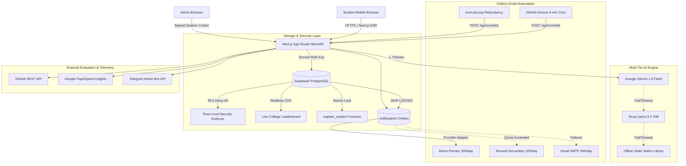

# FirstBuild Engine

> A high-conversion, production-grade growth and workshop operations engine engineered to drive 500 registrations and high verified attendance for the free 60-minute workshop: **"Build Your First AI Project in 60 Minutes"**. Built 100% on free-tier infrastructure with zero reliance on paid tools or n8n.

---

## Architecture Overview



---

## Key Capabilities

- **Tailored AI Blueprint:** Generates a custom project blueprint before registration based on academic branch, interest, and skill level. 3-tier fallback (Gemini -> Groq -> 40+ static blueprints) guarantees zero downtime.
- **Transactional Outbox Automation:** Replaces external automation tools (n8n/Zapier) with an in-database outbox. Notifications are claimed atomically with `SELECT ... FOR UPDATE SKIP LOCKED` and sent via Brevo/Resend/SMTP.
- **Strict Concurrency Seat Allocation:** Guarantees that registrations never exceed the 500-seat cap even under high concurrency using atomic database locks.
- **Viral Growth Flywheel:** Personalized referral links (`/r/[code]`), dynamic OG share cards for LinkedIn and WhatsApp Status (`next/og`), Campus Captain kits (`/captain/[code]`), and live college leaderboards (`/leaderboard`).
- **Live Workshop Room:** Interactive live room (`/live?t=<join_token>`) with idempotent attendance recording, live polls, upvoted Q&A, and milestone check-ins.
- **Automated Submission Evaluator:** Scores student GitHub repositories and PageSpeed metrics via a deterministic pipeline and Gemini rubric scoring, issuing tamper-proof PDF certificates with verification QR codes (`/verify/[id]`).
- **Growth Command Center:** Real vs. synthetic data segregation, funnel simulator, outreach draft copilot, and automated daily Telegram digests.

---

## Quickstart

### Prerequisites
- Node.js >= 18.18.0 (Node 20+ recommended)
- npm >= 9.0.0

### Installation & Local Setup

1. **Clone repository and install dependencies:**
   ```bash
   npm install
   ```

2. **Configure environment variables:**
   ```bash
   cp .env.example .env.local
   ```
   *(See [docs/SETUP.md](docs/SETUP.md) for step-by-step account configuration instructions).*

3. **Verify build and quality gates:**
   ```bash
   npm run typecheck
   npm run lint
   npm run test
   npm run build
   ```

4. **Start local development server:**
   ```bash
   npm run dev
   ```
   Open [http://localhost:3000](http://localhost:3000) to view the application.

---

## Documentation Index

- [docs/SETUP.md](docs/SETUP.md): Step-by-step credentials and third-party configuration.
- [docs/ARCHITECTURE.md](docs/ARCHITECTURE.md): Technical design, patterns, and data flow.
- [docs/API.md](docs/API.md): Endpoint contracts, validation schemas, and error handling.
- [docs/RUNBOOK.md](docs/RUNBOOK.md): Operational failure drills and incident response.
- [docs/ASSUMPTIONS.md](docs/ASSUMPTIONS.md): Free tier limits, verified SDK details, and constraints.
- [docs/AI_DECISION_LOG.md](docs/AI_DECISION_LOG.md): Architectural decisions and pre-loaded rejections.
- [docs/GROWTH_PLAN.md](docs/GROWTH_PLAN.md): Campaign math, channel strategy, and conversion models.
- [docs/DEMO_SCRIPT.md](docs/DEMO_SCRIPT.md): 3-minute video recording walkthrough.
