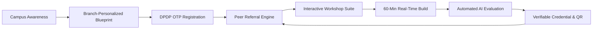
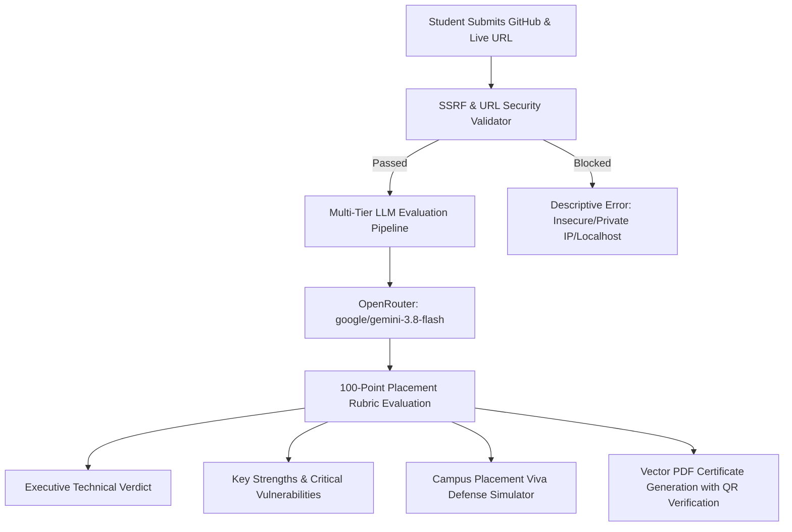
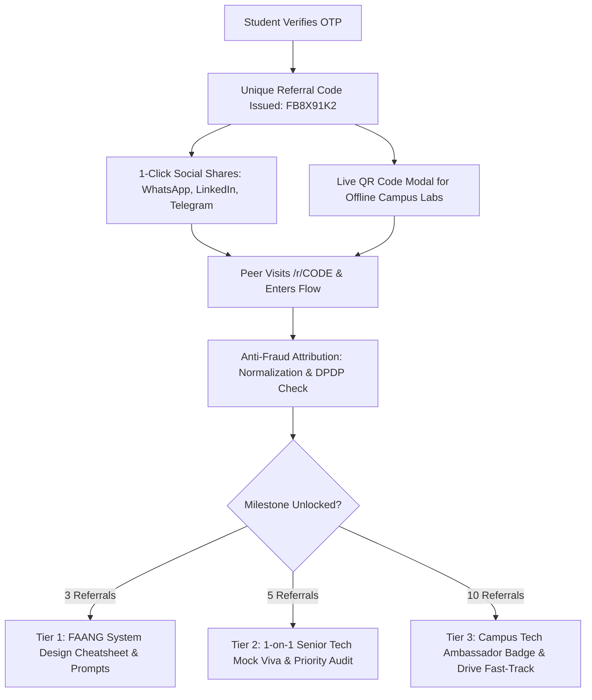

<div align="center">

# ⚡ FirstBuild Growth Engine & CCBP 4.0 AI Suite
### *High-Conversion Growth Operating System, Interactive Workshop Laboratory & Automated AI Evaluation Engine*

[](https://nextjs.org/)
[](https://www.typescriptlang.org/)
[](https://supabase.com/)
[](https://openrouter.ai/)
[](https://tailwindcss.com/)
[](https://vitest.dev/)
[](https://vercel.com/)

<p align="center">
  <b>Engineered for NxtWave CCBP 4.0</b> to drive 500 verified final-year registrations and 200+ live builders for the flagship workshop:<br>
  <b>"Build Your First AI Project in 60 Minutes"</b> &bull; Built 100% on free-tier infrastructure with zero reliance on paid tools or external workflow automation.
</p>

[Explore Live Demo](http://localhost:3000) &bull; [Growth Case Study (Main.md)](Main.md) &bull; [Architecture](#-system-architecture) &bull; [AI Placement Suite](#-ai-placement-suite-9-in-1) &bull; [AI Evaluator](#-automated-ai-project-evaluation--viva-simulator) &bull; [Referral Engine](#-peer-referral--attribution-engine) &bull; [Local Setup](#-quickstart)

</div>

---

## 🧭 Executive Summary & Core Growth Thesis

The **FirstBuild Engine** is not a simple static landing page; it is a **full-stack, closed-loop growth and educational operating system**. 

Traditional free webinars lose 60–70% of registrants before show-time and 80% during the stream. This engine bridges the gap between top-of-funnel acquisition, interactive live coding, automated proof-of-work auditing, and viral peer-to-peer advocacy.



---

## 🏛 System Architecture

The application is structured as a resilient Next.js 16 modular monolith backed by Supabase PostgreSQL with strict Row-Level Security (RLS), an atomic transactional outbox, and a multi-tier resilient AI inference pipeline.

```mermaid
graph TD
    Client[Student Mobile / Desktop Browser] -->|HTTPS / Next.js 16 App Router| NextApp[Next.js Core Monolith]
    Admin[Admin Growth Console] -->|Signed HTTP-Only Session JWT| NextApp

    subgraph "Data, Security & Outbox Layer"
        NextApp -->|Service Role Key| Postgres[(Supabase PostgreSQL)]
        Postgres -->|RLS Deny-All by Default| RLS[Row-Level Security Enforcer]
        Postgres -->|Atomic Function| SeatCap[register_student 500-Cap Lock]
        Postgres -->|SKIP LOCKED| Outbox[(notifications Transactional Outbox)]
        Postgres -->|Real-Time Attribution| RefLedger[(referrals Audit Ledger)]
    end

    subgraph "Multi-Tier AI Inference Pipeline"
        NextApp -->|Tier 1 Primary| OpenRouter[OpenRouter API: Gemini 3.8 Flash]
        OpenRouter -.->|Timeout / Fallback| GeminiSDK[Google Generative AI SDK: Gemini 3.1 Flash]
        GeminiSDK -.->|Fallback| GroqSDK[Groq SDK: Llama 3.3 70B]
        GroqSDK -.->|Offline Mode| StaticLib[40+ Heuristic Blueprint Library]
    end

    subgraph "Orchestration & Heartbeat Schedulers"
        GHA[GitHub Actions 5-Min Cron] -->|POST /api/cron/tick| NextApp
        NextApp --> Outbox
        Outbox -->|Provider Adapter| Brevo[Brevo SMTP / API 300/day]
        Outbox -.->|Quota Failover| Resend[Resend Secondary 100/day]
    end

    subgraph "Proof-of-Work & Trust Layer"
        NextApp -->|SSRF Protected| ExtDeploy[Public Deployed HTTPS URL]
        NextApp -->|REST API| ExtGitHub[Public GitHub Repository]
        NextApp -->|Vector PDF Kit| CertEngine[Certificate of Technical Mastery]
        CertEngine -->|SHA-256 Ledger| QRVerify[/verify/[id] Public Verifier]
    end
```

---

## 🗺 Interactive Application Routes

| Route | Functionality | Key Technological Capabilities |
| :--- | :--- | :--- |
| **`/`** | **Dynamic Hero & Blueprint Flow** | Branch & domain selection, live AI blueprint generation, real-time seat counter, DPDP 2023 consent flow. |
| **`/tools`** | **9-in-1 AI Placement Suite** | Tabbed career tools: ATS Resume Scanner, GitHub Doctor, Cold InMail Pitcher, README Visualizer, etc. |
| **`/referrals`** | **Peer Referral & Milestones Hub** | Alphanumeric code lookup, 1-click WhatsApp/LinkedIn/Telegram shares, live QR code modal, 3-tier rewards, audit ledger. |
| **`/r/[code]`** | **Referral Redirect & Cookie Setter** | Sets 30-day `ref` cookie, preserves UTM query parameters, redirects to registration with auto-filled referral code. |
| **`/live`** | **Interactive Workshop Laboratory** | Synchronized 60-min roadmap with milestone check-ins, pre-flight dev environment checklist, upvoted Q&A feed, live polls. |
| **`/submit`** | **Automated AI Project Evaluator** | SSRF-protected repo & live URL audit, 100-pt rubric, Placement Viva Defense Simulator, executive verdict, PDF issuance. |
| **`/verify/[id]`** | **Cryptographic Credential Verifier** | High-resolution verifiable certificate viewer with SHA-256 fingerprint, student details, score breakdown, LinkedIn badge. |
| **`/dashboard/me`** | **Student Admission Pass** | Verified seat credential, live room countdown, batch metadata, embedded referral progress tracker. |
| **`/leaderboard`** | **National Campus Leaderboard** | Live college rankings with client-side instant search, state filters, podium badges, and synthetic comparison seeding. |
| **`/captain/[code]`**| **Campus Captain Toolkit** | Forward-ready WhatsApp messages in English, Hindi, and Telugu, native `wa.me` links, dynamic 9:16 WhatsApp Status image generator (`/api/og/[code]`). |
| **`/admin`** | **Growth Command Center** | Funnel conversion analytics (Views &rarr; Blueprints &rarr; OTPs &rarr; Seats &rarr; Attendees), interactive growth simulator, manual cron triggers. |

---

## 🤖 Automated AI Project Evaluation & Viva Simulator

Located at [`/submit`](http://localhost:3000/submit) and powered by [`lib/evaluator/pipeline.ts`](lib/evaluator/pipeline.ts), this system conducts a comprehensive, multi-dimensional technical evaluation of student project submissions using **OpenRouter Gemini 3.8 Flash**.



### The 100-Point Placement Rubric
* **Works Deployed (0–30 pts):** Verified public HTTPS accessibility, latency benchmarking, responsive UI rendering, zero uncaught runtime errors.
* **AI Integration & Inference (0–25 pts):** Genuine generative LLM orchestration, structured JSON parsing, prompt engineering, fallback design.
* **Originality & Innovation (0–15 pts):** Meaningful domain problem solving vs. generic tutorial cloning.
* **Technical Documentation (0–15 pts):** Mermaid architecture diagrams, local setup instructions, API contracts, TypeScript interfaces.
* **Code Quality & Modularity (0–15 pts):** Clean separation of concerns, defensive error boundaries, environment secret hygiene.

### Campus Placement Viva Defense Simulator
To prepare students for tough technical interviews (TCS Digital, Amazon, product startups) and university examiners, the engine generates:
1. **The Exact Viva Question:** A challenging architectural question probing edge cases, rate limits, or concurrency.
2. **FAANG-Grade Model Response:** An authoritative, highly articulate model answer teaching students how to defend their architectural decisions.

---

## 🎁 Peer Referral & Attribution Engine

Located at [`/referrals`](http://localhost:3000/referrals), the referral engine turns every verified student into an active campus promoter through a transparent, gamified attribution ledger:



* **Anti-Fraud Security:** Self-referrals are blocked via normalized email matching (`email_normalized`), IP hash checks, and atomic database functions.
* **Real-Time Attribution Ledger:** Displays privacy-masked peer names (`Anan***`), college, verification status (`Verified`, `Pending OTP`), and exact timestamps.
* **Native Omnichannel Sharing:** Pre-composed, high-converting messages with direct `wa.me`, LinkedIn share-offsite, and Telegram intent URLs.

---

## 🧰 AI Placement Suite (9-in-1)

Available at [`/tools`](http://localhost:3000/tools), this suite provides tangible career and placement value before, during, and after the workshop:

1. **ATS Resume Scanner (`#ats-scanner`):** Audits resumes against company-specific ATS rubrics (Amazon, TCS Digital, Cognizant) and generates Google XYZ bullets.
2. **AI GitHub Repo Doctor (`#github-doctor`):** Analyzes repository velocity, commit cleanliness, and computes a Recruiter Attractiveness Index.
3. **1-Click Cold InMail & Pitch Generator (`#cold-pitch`):** Generates 75-word proof-of-work outreach messages citing live deployed URLs for hiring managers.
4. **FAANG README & Architecture Visualizer (`#readme-generator`):** Generates open-source grade documentation with embedded vector Mermaid flowcharts.
5. **Non-CSE Career Bridge (`#career-bridge`):** Maps core engineering principles (Mechanical thermodynamics, ECE circuit logic) directly into distributed software architectures.
6. **CTC Tier Leap Predictor (`#ctc-predictor`):** Calculates concrete project milestones required to jump from mass recruiter packages (₹3.5L) to product engineering tiers (₹9.5L–₹14L).
7. **IEEE Major Project Synopsis Generator (`#major-project-synopsis`):** Generates formal academic synopses compliant with university Sem 7/8 thesis formats.
8. **2026 Tech Market Radar (`#tech-trends`):** Aggregates live hiring pulse and compensation data across HackerNews, Dev.to, and GitHub.
9. **AI Project Blueprint Generator (`#blueprints`):** Scaffolds 60-minute tailored full-stack project architectures based on branch and domain.

---

## 🔒 Security, Privacy & Infrastructure

* **India DPDP Act 2023 Compliance:** Mandatory explicit consent checkboxes, granular legal disclosures, and cryptographically salted IP hashing (`IP_HASH_SALT`) for anonymous anti-fraud rate-limiting.
* **Server-Side Request Forgery (SSRF) Protection:** Custom IP/DNS validator rejects requests targeting `localhost`, `127.0.0.1`, `::1`, RFC 1918 private subnets (`10.0.0.0/8`, `172.16.0.0/12`, `192.168.0.0/16`), AWS metadata (`169.254.169.254`), and internal TLDs.
* **Transactional Outbox Pattern:** Zero reliance on fragile third-party webhook tools (n8n/Zapier). All notifications are staged in a Postgres table and swept atomically with `SELECT ... FOR UPDATE SKIP LOCKED` by an idempotent heartbeat endpoint (`/api/cron/tick`).
* **Vercel Hobby Plan Compliant:** Strict compliance with Vercel Hobby daily cron rules (`30 14 * * *`) with frequent 5-minute ticks handled by GitHub Actions (`.github/workflows/scheduler.yml`).

---

## 🧪 Testing & Verification

The codebase includes an extensive automated test suite covering all business logic, AI fallbacks, SSRF defenses, and database schema constraints.

```bash
# Run complete unit test suite across all 18 test files
npx vitest run

# Run TypeScript strict type verification
npm run typecheck

# Execute Next.js production build verification
npm run build
```

```
✓ tests/unit/env.test.ts (6 tests)
✓ tests/unit/phase6-admin-and-synthetic.test.ts (3 tests)
✓ tests/unit/phase5-outreach-and-og.test.ts (4 tests)
✓ tests/unit/ats-scanner.test.ts (4 tests)
✓ tests/unit/static-blueprints.test.ts (4 tests)
✓ tests/unit/major-project-synopsis.test.ts (2 tests)
✓ tests/unit/ctc-predictor.test.ts (3 tests)
✓ tests/unit/readme-generator.test.ts (1 test)
✓ tests/unit/career-bridge.test.ts (2 tests)
✓ tests/unit/github-doctor.test.ts (2 tests)
✓ tests/unit/scheduler-and-alerts.test.ts (4 tests)
✓ tests/unit/email-normalization.test.ts (4 tests)
✓ tests/unit/registration-flow.test.ts (9 tests)
✓ tests/unit/cold-pitch.test.ts (1 test)
✓ tests/unit/phase7-live-and-evaluator.test.ts (7 tests)
✓ tests/unit/tech-trends.test.ts (2 tests)
✓ tests/unit/ai-fallback.test.ts (5 tests)
✓ tests/unit/referral-tracker.test.ts (4 tests)

Test Files  18 passed (18)
     Tests  67 passed (67)
```

---

## 🚀 Quickstart

### Prerequisites
- **Node.js:** `>= 18.18.0` (Node 20+ LTS recommended)
- **Package Manager:** `npm >= 9.0.0`

### 1. Clone & Install
```bash
git clone https://github.com/AyushDeshmukh18/WorkshopX.git
cd WorkshopX
npm install
```

### 2. Configure Environment Variables
Copy `.env.example` to `.env.local`:
```bash
cp .env.example .env.local
```

| Variable | Required | Description / Default |
| :--- | :---: | :--- |
| `OPENROUTER_API_KEY` | **Recommended** | OpenRouter API Key for Tier 1 Gemini 3.8 Flash evaluation & blueprints. |
| `OPENROUTER_MODEL` | Optional | Defaults to `google/gemini-3.8-flash`. |
| `GEMINI_API_KEY` | Optional | Direct Google AI Studio key for Tier 2 fallback. |
| `NEXT_PUBLIC_APP_URL` | **Yes** | Root app URL (e.g. `http://localhost:3000` or production domain). |
| `NEXT_PUBLIC_SUPABASE_URL`| **Yes** | Supabase Project URL. |
| `NEXT_PUBLIC_SUPABASE_PUBLISHABLE_KEY` | **Yes** | Supabase anonymous public key. |
| `SUPABASE_SECRET_KEY` | **Yes** | Supabase `service_role` backend key. |
| `SESSION_SECRET` | **Yes** | 32+ character random string for signing admin JWT sessions. |
| `CRON_SECRET` | **Yes** | Secret bearer token protecting `/api/cron/tick`. |
| `ADMIN_EMAILS` | **Yes** | Comma-separated admin email list for `/admin` access. |
| `IP_HASH_SALT` | **Yes** | Random string for DPDP-compliant anonymous IP hashing. |
| `EMAIL_PROVIDER` | Optional | `brevo` (default) or `resend`. |
| `BREVO_API_KEY` | Optional | Brevo API key for transactional emails. |

### 3. Launch Development Server
```bash
npm run dev
```
Open [http://localhost:3000](http://localhost:3000) in your browser.

---

## 📦 Deployment on Vercel

1. Import this repository into [Vercel](https://vercel.com/new).
2. Framework preset: **Next.js** (auto-detected).
3. Populate the required environment variables in **Project Settings &rarr; Environment Variables**.
4. Click **Deploy**. The project will build cleanly in ~90 seconds with 0 warnings or errors.

---

<div align="center">
  <sub>Built with precision for the <b>NxtWave CCBP 4.0 Growth Challenge</b>. Designed to turn 500 registrations into a compounding, self-sustaining community of student software builders.</sub>
</div>
