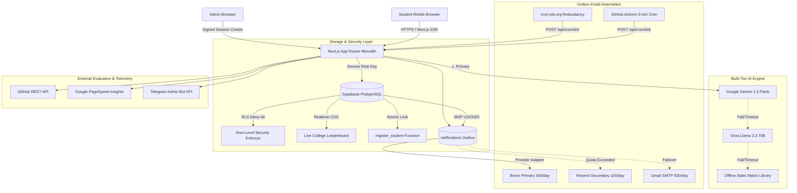

# System Architecture & Technical Specifications

**FirstBuild Engine** is a high-reliability, zero-cost growth infrastructure engineered for the "Build Your First AI Project in 60 Minutes" workshop. It combines a Next.js App Router monolith, Supabase Postgres with Row-Level Security, an idempotent transactional outbox, and a resilient multi-tier AI fallback engine.

---

## 1. High-Level Architecture Diagram



---

## 2. Core Architectural Patterns

### A. The Transactional Outbox Pattern
To prevent email losses, duplicate dispatches, or runtime serverless timeout failures:
1. Application events (registration verified, milestone achieved, reminder scheduled) **never send emails directly**.
2. Instead, they insert structured rows into the `notifications` outbox table within the same database transaction.
3. Every 5 minutes, `/api/cron/tick` claims a bounded batch of rows using:
   ```sql
   SELECT id, registration_id, kind, channel
   FROM notifications
   WHERE status = 'pending' AND run_at <= now()
   LIMIT 10
   FOR UPDATE SKIP LOCKED;
   ```
4. This ensures strict concurrency safety across overlapping cron executions.
5. If the daily email quota is reached, rows remain `pending` (never marked failed) and dispatch automatically once the quota resets.

### B. High-Concurrency Seat Allocation
To prevent exceeding the 500-seat workshop cap under viral traffic:
- Registration executes inside a single stored procedure (`register_student`).
- An exclusive advisory lock or row-level lock on `app_settings` checks `registration_cap - count(verified) > 0` before any row creation.
- If the cap is reached, the transaction rolls back cleanly and returns typed error `CAP_REACHED`.

### C. Multi-Tier AI Degradation
- **Tier 1 (Gemini 1.5 Flash):** Structured JSON mode (`responseMimeType: "application/json"`). Bounded 8s timeout with one retry.
- **Tier 2 (Groq Llama 3.3 70B):** JSON object mode fallback if Gemini returns 429/5xx or invalid schema.
- **Tier 3 (Static Blueprint Library):** 40+ pre-validated blueprints covering all branch and interest permutations.
- **Outcome:** The user is **never** presented with a 500 error or broken UI due to upstream AI provider downtime.

### D. Zero-PII Anonymous Realtime
- Direct anonymous read access to the database is disabled by default via RLS on all tables.
- Only aggregated metrics tables (`college_stats`) and interactive workshop room tables (`polls`, `qa_questions`, `checkins`) permit scoped `SELECT` access.
- Leaderboard updates stream to student devices via Supabase Realtime with zero exposure of student names, emails, or phone numbers.
